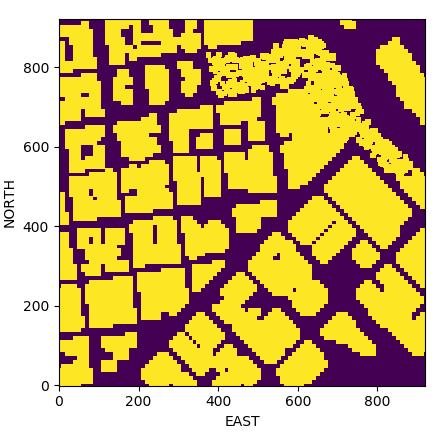
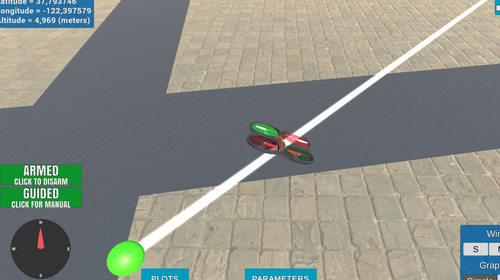

## Project: 3D Motion Planning

---

# Required Steps for a Passing Submission:
1. Load the 2.5D map in the colliders.csv file describing the environment.
2. Discretize the environment into a grid or graph representation.
3. Define the start and goal locations.
4. Perform a search using A* or other search algorithm.
5. Use a collinearity test or ray tracing method (like Bresenham) to remove unnecessary waypoints.
6. Return waypoints in local ECEF coordinates (format for `self.all_waypoints` is [N, E, altitude, heading], where the drone’s start location corresponds to [0, 0, 0, 0].
7. Write it up.
8. Congratulations!  Your Done!

## [Rubric](https://review.udacity.com/#!/rubrics/1534/view) Points
### Here I will consider the rubric points individually and describe how I addressed each point in my implementation.  

---
### Writeup / README

### Explain the Starter Code

#### 1. Explain the functionality of what's provided in `motion_planning.py` and `planning_utils.py`

`motion_planning.py` is a modified version of backyard_flyer.py that uses functions from `planning_utils.py`.
Between `ARMING` and `TAKEOFF` there is a new state called `PLANNING`. On this state the method `plan_path()` is called to search for a plan, the relevant methods of this method are in `planning_utils.py`, such as the implementation of the a star search algorithm.

When executed, on the planning phase draws a not relevant zig-zag path of waypoints, which may be changed to a usefull path. 

On the `plan_path` method:

1. The map is loaded from `colliders.csv`
2. A grid is calculated with the method `create_grid` from `planning_utils.py`. 
3. The goal grid is set.
4. The search algorithm, A star, is executed using the `a_star` method from module `planning_utils.py`.
5. The waypoints are generated and are sent to the simulator using the method `send_waypoints`.
6. The drone follows the waypoints.

### Implementing Your Path Planning Algorithm

#### 1. Set your global home position

I read the first line of `colliders.csv` and extracted the values to float, being `lat0`  37.792480 and `lon0` -122.397450.
 
Then I set home with `self.set_home_position(lon0, lat0, 0)`.

[Lines 135 to 138](motion_planning.py#135-138)

#### 2. Set your current local position

I used the suggested function `global_to_local(self.global_position, self.global_home)`.

[Line 142](motion_planning.py#142-143)

#### 3. Set grid start position from local position

The `grid_start` position was set from `local_north` and `local_east`. 

[Lines 157 to 159](motion_planning.py#157-159)

Configuration space:

#### 4. Set grid goal position from geodetic coords

To accept arbitrary goal position I set the coordinates to (longitude, latitude, altitude) as arguments.

To set the goal position use command line arguments `goal_lon` for longitude, `goal_lat` for latitude, and `goal_alt` for altitude. 

For example:

`python motion_planning.py --goal_lat 37.794032 --goal_lon -122.397317 --goal_alt 5`

[Lines 164 to 165](motion_planning.py#164-165) and [Lines 209 to 211](motion_planning.py#209-211)

#### 5. Modify A* to include diagonal motion (or replace A* altogether)

I added four new actions, four each type of diagonal qith a cost of `sqrt(2)`.

[Lines 54 to 63](motion_planning.py#54-63) and [Lines 93 to 100](motion_planning.py#93-100) 

#### 6. Cull waypoints 
For this step you can use a collinearity test or ray tracing method like Bresenham. The idea is simply to prune your path of unnecessary waypoints. Explain the code you used to accomplish this step.

To prune the path of unnecessary waypoints, I implemented collinearity test in `planning_utils.py` and applied to the path obtained from A star search.

[Lines 173 to 187](motion_planning.py#173-187) 

### Execute the flight
#### 1. Does it work?

Yes, it works!

